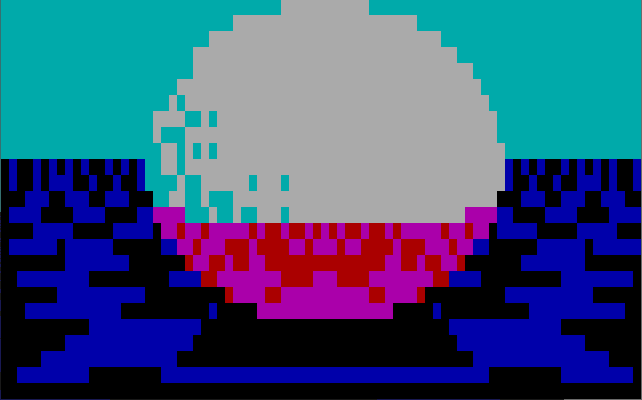

## Description

This repository contains two raytracer programs written in [Turbo Pascal](https://en.wikipedia.org/wiki/Turbo_Pascal) for MS-DOS:  and 

1) Text mode (default is 80x25)


2) Graphics mode (640x480)


The algorithm is based on the BASIC programs for BBC Micro by [Steve McCrea](https://twitter.com/Kweepa).
 
Scene parameters are the following:
* Rays start at (0, 0.23, -2)
* Sphere of radius 1 is placed at the origin
* Floor plane is at Y=-2


## Text mode raytracer

Full source code: [RTTXT.PAS](RTTXT.PAS)

At the beginning get console mode dimensions. Usually, they are 80x25 but why not support other options.
```pascal
  MaxX := Lo(WindMax);
  MaxY := Hi(WindMax);
```

Set parameters of rays' origin at (0, 0.23, -2):
```pascal
  H := 0.23;
  J := H * H;
```

Loops enumerate all character position aka 'pixels':
```pascal
  for V := 0 TO MaxY do
    for U := 0 to MaxX do
```

Convert screen coordinates to bounds [-1..1, -0.8..0.6]:
```pascal
      X := (U - 40) / 40;
      Y := 0.6 - 1.4 * V / 25;
```

Calculate ray’s direction (X,Y,Z). Here the perspective is provided by calculation of Z with inverset square root function Z=1/Sqrt(L+1). Then Normalize the rest of vector's components X and Y:
```pascal
      Z := 1 / Sqrt(X * X + Y * Y + 1);
      X := X * Z;
      Y := Y * Z;
```

Check intersection of a sphere with the ray. Parameter `B` is a flag for choosing fileal colour later:
```pascal
      D := 4*Z*Z + J*Y*Y - (3+J);
      B := 0;
```

If the ray intersects with the sphere occurs, reflect the ray from the sphere""
```pascal
      if D>0 then
      begin
        T := 2 * Z - H * Y - Sqrt(D);
        X := T * X;
        Y := T * Y + H;
        Z := T * Z - 2;
        B := 4;
      end;
```

If the ray is headed down (`Y<0`), intersect it with the floor plane at `Y=-2`. Choose tile colour using `(Int(X)+Int(Z)) And 1`. If the ray hit the sphere add `B` to the colour for switching to reflection color:
```pascal
      if Y<0 then
      begin
        P := (Y + 2) / Y;
        C := (Round(Int(X * P) + Int(Z * P)) And 1) + B;
      end
```

If the ray is headed up (`Y>=0`), set sky color (11, Cyan)
```pascal
        C := 11;
```

If the coordinate is near (1,1,-1) and the ray bounced off the sphere (`D>0`), randomly choose white (15) colour for dithering. Note that two checks and not united into one condition because otherwise Turbo Pascal will handle `Random` result as `Integer` and the code won't compile.
```pascal
        if D>0 then
          if Random>(1-X-Y+Z) then
            C := 15;
```

Put current 'pixel' to position U,V. Since enumeration is sequential, just put whitespace character of specific color `C`.
```pascal
      TextBackground(C);
      Write(' ');
```

## Graphics mode raytracer

Full source code: [RTVGA.PAS](RTVGA.PAS)

This program is the same as text mode version with an addition of VGA initialization.

One particular note is that the constant `BgiPath` must specify the directory path where the graphics drivers can be found. For current value the friver files must be in the current directory. Driver files (`*.BGI` and `*.CHR`) usually can be found inside the `BGI` folder of the Turbo Pascal installation.
```pascal
const
  BgiPath = '.';
```


## Links
* Tweets by Steve McCrea:
 * [Text mode raytracer](https://twitter.com/Kweepa/status/1305994537375092736)
 * [Graphics mode raytracer](https://twitter.com/Kweepa/status/1305995378660179969)
 * [Annotated graphics raytracer](https://twitter.com/Kweepa/status/1306006615691333640)
 